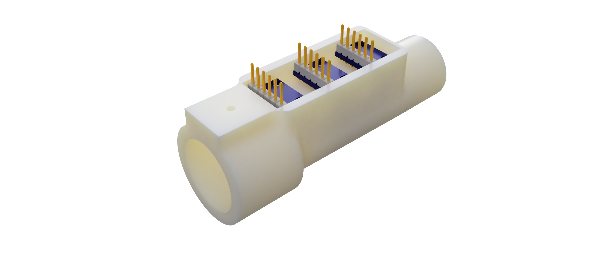

# OpenRS
Open Respiratory Sensor

## Project Aim

This projects aims at offering an affordable and easy to make at home respiratory sensor design. The primary focus of this sensor design is to assist in safe manual ventilation but it potentially could also be used as part of other projects such as open source mechanical ventilators. 

## Design

The project is divided in two parts: 

1. The sensor unit
2. The manual ventilation feedback unit

### Sensor unit

The main aim of the sensor unit is to be used close to the patient and provide measurement of pressure and air-flow (bi-directional). 

**Documentation:**   
- Requirements 
- Design rationale  
- Tests (TODO)  

**Design Files:**   
- The *CAD* folder for the Fusion 360 archive including the full assembly.  
- The *source* folder includes an Arduino project with the source code to read the sensor  

**Manufacturing Files:** The *CAM* folder includes an STL file ready to be 3D printed. 

### Manual Ventilation Feedback (MVF) unit

The main aim of the manual ventilation feedback unit is to provide feedback to someone manually operating a bag valve mask in order to ensure safe usage and reduce the risk of lung damage from improper use. 

**Documentation:** TODO

