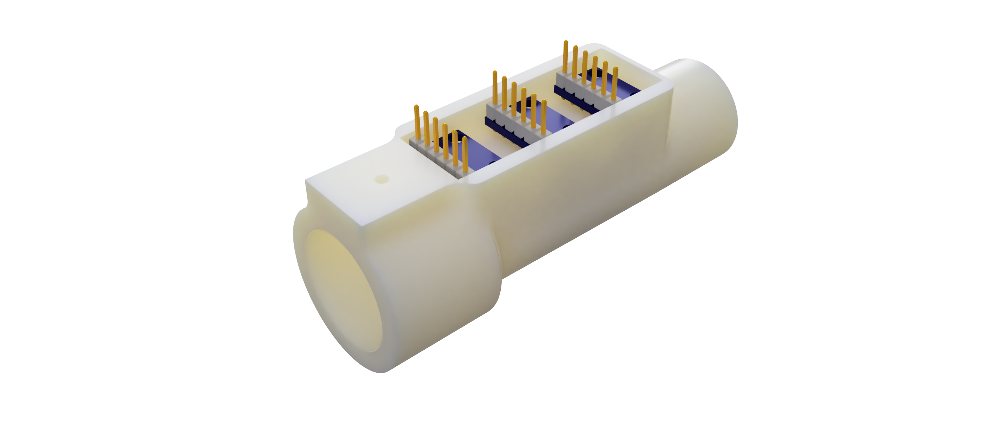

# OpenRS - Open Respiratory Sensor

**Disclaimer:** This project is not meant to be used as a medical device as it is. It has not been reviewed nor validated by any trained professional and should not be used with any patients. In its current state it is only meant to demonstrate what is achievable with a very low resource design and provide inspiration for other projects. 

## Project Summary

This projects ultimate aim is to offer an open-source, affordable, and easy to make respiratory sensor design. The primary focus of this sensor is to be used with a feedback device to assist in the safe operation of a manual ventilation device (bag valve mask). It is however not limited to that use and could also be used as part of a mechanical ventilator. 

The project is composed of the sensor device itself as well as of a ventilation feedback device (VFD) that uses the sensor readings to provide visual and auditory feedback to the bag valve mask operator.

## Context and use case

Many developing countries have a critical lack of mechanical ventilator, with at least 10 countries in Africa having none at all and 9 other having less than 1 per million people [[1](https://www.nytimes.com/2020/04/18/world/africa/africa-coronavirus-ventilators.html)]. In that context, practicians are often forced to use manual ventilation with bag valve masks (BVM) in lieu of mechanical ventilation. However, such manual ventilation requires around-the-clock operation and the lack of trained practician in those settings often mean that the family members of the patients are asked to operate the manual ventilators themselves for extended periods of time [[2](https://academic.oup.com/qjmed/article/101/12/990/1564042)]. This present serious risks as improper use of BVMs can cause very serious lung injuries that can cause long term disability and even death [[3](https://www.ncbi.nlm.nih.gov/pubmed/8637092)],[[4](https://www.ncbi.nlm.nih.gov/pubmed/3280263)]. Several studies have found that even amongst trained professionals improper use of BVM was endemic [[5](https://www.ncbi.nlm.nih.gov/pubmed/15066941)] with one study finding that over 88% of practicians evaluated delivered excessive pressure and 73% delivered excessive volume [[6](https://www.ncbi.nlm.nih.gov/pubmed/22005778)]. To remedy this issue, devices providing feedback on manual ventilation have already been shown to decrease the risk of misuse by >70% [[6](https://www.ncbi.nlm.nih.gov/pubmed/22005778)]. However, the current designs are not open source, too complex to replicate and too expensive for use in low resource settings. Our proposed open source design is optimized for affordability and ease of replication to fill that current gap. 

## Sensor device

The sensor device provides measurement of airway pressure, gas flow (bi-directional), temperature and humidity (optional). It is designed to be placed close to the patient and measure those metrics with a meaningful range and accuracy for respiratory monitoring. 

**Documentation:**   
- [Requirements](sensor_device/sensor_device_requirements.md)  
- Design rationale  
- Tests (TODO)  

**Design Files:**   
- The *CAD* folder for the Fusion 360 archive including the full assembly.  
- The *source* folder includes an Arduino project with the source code to read the sensor  

**Manufacturing Files:**  
- The *CAM* folder includes an STL file for 3D printing  
- The *assembly_manual* file includes instruction on how to 3D print the part and assemble them. 

## Ventilation Feedback Device (VFD)

The main aim of the ventilation feedback device is to provide feedback to someone manually operating a bag valve mask in order to ensure safe usage and reduce the risk of lung damage from improper use. 

**Documentation:** TODO

